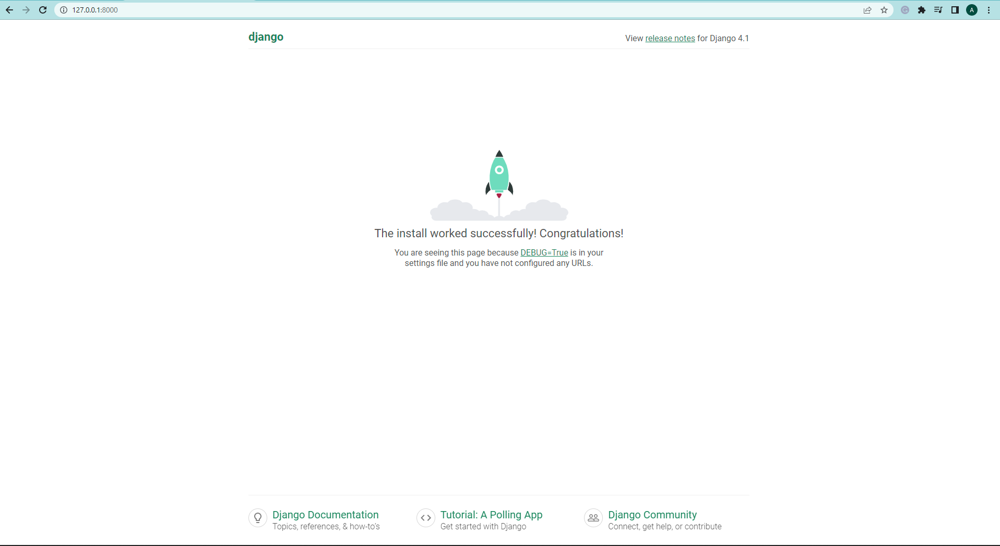
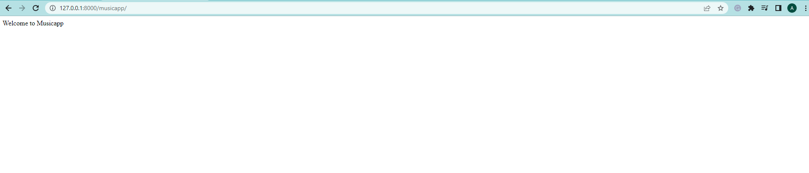
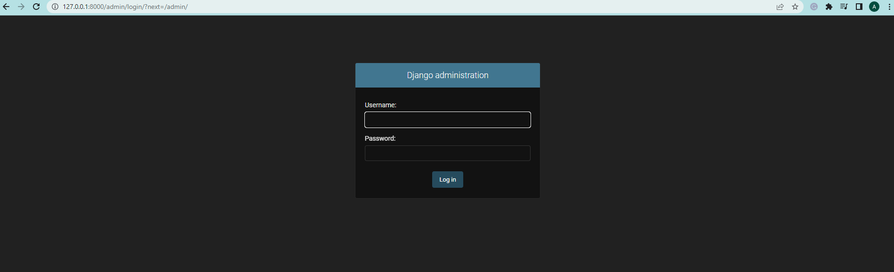

# Week 4 Python Task

## 📝 This is a task for I4GxZuri

### 📜 Task Title

- Pip, Virtual environments and intro to Django

### ✍ Instructions

- Create a new Django project named “songcrud” and create an app in the project called “musicapp”.
- Your project must contain a requirements.txt file housing all the pinned dependencies from your project.
- Push the project to GitHub and submit your public GitHub repository link.

*Note: Always create a virtual environment anytime you're working on a new Django project. You can get your requirements.txt file from your virtual environment*

### 📚 Resources

1. [How to use Pip](https://www.youtube.com/watch?v=DLONio11J94&list=PLxuUHF3OiqfUre0fws5Y33YMfGJnzTBMZ&index=7)
2. [Installing and activating virtual environments](https://www.youtube.com/watch?v=0Gv7xeYsGGA&list=PLxuUHF3OiqfWAITD4gPUHZ1GcYRqmyF7P&index=42)
3. [Introduction to Django](https://www.youtube.com/watch?v=SRiVE6ibgaU&t=1860s)
4. [Setting up a django project](https://www.youtube.com/watch?v=xE_9JXYYGvg&list=PLxuUHF3OiqfWAITD4gPUHZ1GcYRqmyF7P&index=44)
5. [Creating an app in django](https://www.youtube.com/watch?v=DNeZ0vxV7vw&list=PLxuUHF3OiqfWAITD4gPUHZ1GcYRqmyF7P&index=45&t=106s)

### 🔧 Tools

- Django version 4.1.2
- Python version 3.10.4
- Visual Studio Code version 1.68
- Git 2.36.1
- Github repository

### 📌 Important links

- Django: https://www.djangoproject.com/
- Python: https://www.python.org/
- Visual: Studio Code https://code.visualstudio.com/
- Git: https://git-scm.com/

### 📂 Project samples

#### ⭐ Thanks I4GxZuri Team and Mentors 🏅
